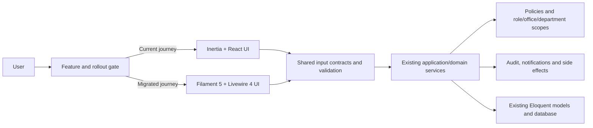

# GovATS Transition Strategy: Inertia/React to Filament 5

**Prepared:** 27 August 2026  
**Application:** Government Assignment Tracking System (GovATS)  
**Current frontend:** Inertia 2, React 19, TypeScript, Tailwind CSS 4 and Vite  
**Target UI framework:** Filament 5 panel builder on the existing Laravel application  
**Primary objective:** Replace the presentation layer incrementally without changing business rules, security boundaries, workflows, form behavior, stored data or user-visible capabilities.

## 1. Executive recommendation

Do **not** attempt a one-step rewrite of the existing React application into generated Filament resources. The safest transition is a **parallel-panel migration**, sometimes called the strangler pattern:

1. Keep the current Inertia application operational and unchanged.
2. Add one Filament 5 panel at a temporary path such as `/workspace-v2`.
3. Reuse the existing models, policies, query scopes, services, presenters, enums, audit logger and notification services.
4. Migrate one complete user journey at a time behind a per-user or per-role feature flag.
5. Run the old and new screens against the same database and domain services.
6. Compare authorization, validation, output, audit events and side effects before enabling each Filament screen for more users.
7. Move the canonical route to Filament only after the new journey passes functional, visual, accessibility and role-isolation tests.
8. Retain the previous route for a defined rollback period before deleting React code.

Filament should become a new **delivery adapter** around GovATS, not a new business-logic layer.



### Why this is the best fit for GovATS

The repository already has useful separation between presentation and behavior:

- 47 controller files orchestrate HTTP requests.
- 14 Form Request classes validate core task and correspondence operations.
- 35 services contain searching, reporting, workflow, assignment, mail, notification and dashboard behavior.
- `TaskPolicy` and `MailRecordPolicy` contain sensitive authorization decisions.
- `TaskScope`, `MailAccessScope`, `SecretaryAuthorityService`, `SecretaryOfficeScope` and related services enforce data visibility.
- 42 feature-test files already cover major security and workflow contracts.
- React pages use reusable ATS shell, drawer, modal, badge, progress, picker and error-summary components.

This separation allows a new Filament interface to call the same application services. The migration risk is therefore primarily in request adaptation, query scoping, authorization and presentation parity—not in the database.

## 2. Version and compatibility gate

Use **Filament 5**, not Filament 3 or 4, for a new migration. At the time this strategy was prepared, Filament 5 is the current stable documentation line.

The official Filament 5 installation requirements are:

- PHP 8.2 or later
- Laravel 11.28 or later
- Tailwind CSS 4.1 or later
- Livewire 4 for the Filament 5 stack

GovATS currently has PHP `^8.2`, Laravel `13.*`, Tailwind `^4.0.0`, React 19 and Inertia 2. PHP and Laravel are compatible on paper. Tailwind must be explicitly upgraded to at least 4.1, and Composer must prove that Filament 5 and Livewire 4 resolve cleanly with the existing packages.

Official references:

- [Filament 5 installation](https://filamentphp.com/docs/5.x/introduction/installation)
- [Filament 5 styling and custom themes](https://filamentphp.com/docs/5.x/styling/overview)
- [Filament 5 security guidance](https://filamentphp.com/docs/5.x/advanced/security)
- [Filament 5 resource testing](https://filamentphp.com/docs/5.x/testing/testing-resources)
- [Filament 5 action testing](https://filamentphp.com/docs/5.x/testing/testing-actions)

### Compatibility rules

- Perform the dependency experiment on a dedicated branch.
- Commit the current lockfiles before changing dependencies.
- Run `composer why-not filament/filament ^5.0` before installation.
- Run `composer require filament/filament:"^5.0" -W` only after reviewing the dry-run dependency plan.
- In Windows PowerShell, use Filament's documented `~5.0` constraint if caret handling causes a problem.
- Upgrade Tailwind deliberately; do not use an installer option that overwrites the existing Vite, CSS or React bootstrap files.
- Do not run `php artisan filament:install --scaffold` in this existing application. Filament explicitly warns that scaffolding can overwrite application files and is suited to new projects.
- Install the panel builder, then generate a separate panel provider.
- Build both the existing React bundle and the new Filament theme in CI throughout coexistence.
- Do not install third-party Filament plugins during the foundation phase. Add a plugin only after confirming Filament 5 compatibility, maintenance status, permissions, data access and test coverage.

## 3. Non-negotiable preservation contract

The following are migration invariants. A Filament page cannot be marked complete if any invariant changes unintentionally.

### Business and data invariants

- No database-table rename, destructive migration or status-value change is needed for the UI migration.
- Existing task, assignment, correspondence and mail lifecycle enums keep the same meanings.
- Existing services remain the only place that performs workflow transitions.
- Reference-number generation, duplicate detection, recipient resolution and report calculations remain unchanged.
- Current transaction boundaries and idempotency behavior remain unchanged.
- Existing audit events retain the same event names, actors, subjects, context and timestamps.
- Existing email, browser-push and in-app notification side effects remain unchanged.
- Existing file storage, preview, download and print behavior remains unchanged until a separately approved file-migration project.

### Security invariants

- Fortify remains the authentication authority during migration.
- The existing `web` guard and session are shared by Inertia and Filament.
- Password-change enforcement, password confirmation and two-factor authentication continue to work.
- `RequireWorkMode`, `RequirePasswordChange`, capability middleware and role rules are not bypassed.
- `TaskPolicy`, `MailRecordPolicy` and all access-scope services remain authoritative.
- Filament resource queries must never begin with an unrestricted model query for correspondence or tasks.
- Custom Filament actions require explicit authorization; button visibility alone is not authorization.
- Every Livewire interaction is treated as a new server request and must be authorized again.
- System administrators must retain their existing mail-isolation rules.
- Secretaries must remain limited by attachment, supported office and delegated permissions.
- Department officers, commissioners, the Permanent Secretary and clerks must see exactly the same records they see today.

Filament automatically observes Laravel policies for standard resource CRUD, but custom actions and pages still require explicit authorization. Filament also documents that resource queries return all model records by default unless the developer scopes them. This is the largest migration-specific security risk for GovATS. See [Filament security](https://filamentphp.com/docs/5.x/advanced/security).

### Form invariants

For each migrated form, preserve:

- Field names and payload meaning
- Field order and grouping, unless a documented usability improvement is approved
- Labels, help text and placeholders
- Required and optional states
- Defaults and derived values
- Conditional visibility and enabled/disabled behavior
- Date, time and timezone interpretation (`Africa/Kampala`)
- Select-option sources and office/department scoping
- Duplicate-mail warnings
- File MIME, count and size rules
- Existing-record attachment behavior
- Validation messages where users depend on them
- Confirmation dialogs for destructive or irreversible actions
- Redirect or drawer-closing behavior after success
- Audit and notification side effects

### User-experience invariants

- Department Work remains the first navigation item and the main operational dashboard for its users.
- Mails remains second and Search Mail remains third.
- Filed Correspondence remains the last applicable sidebar item.
- Meetings and deadlines remains the first Department Work section and is open by default.
- Other dashboard sections remain minimized by default.
- Users retain the ability to hide, clear and restore office notifications.
- Mail and task details keep the same hierarchy of annotations, people, forwarding and workflow history.
- Incoming, outgoing and task drawers use one consistent slide-over pattern.
- Typography stays normal-weight for body text, form values, table cells and descriptive text.
- Light, dark and system theme modes remain available.
- Mobile, keyboard and screen-reader operation must not regress.

## 4. Target architecture

### 4.1 Recommended panel structure

Start with one panel:

```text
Panel ID: workspace
Temporary path: /workspace-v2
Guard: web
Purpose: all authenticated operational and administration journeys
```

Avoid creating separate panels for every role. Multiple role-specific panels would duplicate resources, themes, navigation and testing. GovATS roles often share workflows with different scopes; a single panel with policy-driven access is easier to keep uniform.

A second panel is justified only if there is a truly separate security boundary—for example, a future public portal on another domain—not merely a different sidebar.

### 4.2 Recommended source layout

```text
app/
├── Application/
│   ├── Mail/Actions/                 # UI-agnostic command handlers
│   ├── Tasks/Actions/
│   ├── Reports/
│   └── Validation/                   # shared rule providers
├── Filament/
│   └── Workspace/
│       ├── Clusters/
│       │   ├── Administration/
│       │   └── ReportsAndPerformance/
│       ├── Pages/
│       │   ├── DepartmentWork.php
│       │   ├── SearchMail.php
│       │   └── Notifications.php
│       ├── Resources/
│       │   ├── MailRecords/
│       │   ├── Tasks/
│       │   ├── Users/
│       │   ├── Departments/
│       │   └── Divisions/
│       ├── Schemas/                  # shared forms/infolists
│       ├── Tables/                   # shared columns/filters/actions
│       ├── Actions/                  # presentation adapters only
│       └── Widgets/
├── Http/
│   ├── Controllers/                  # retained during coexistence
│   └── Requests/                     # retained; delegate to shared rules
├── Policies/                         # unchanged authority
└── Services/                         # existing domain/application behavior

resources/
├── css/
│   ├── app.css                       # current Inertia theme
│   └── filament/workspace/theme.css  # Filament theme using the same tokens
└── views/filament/workspace/
    ├── pages/
    ├── components/
    └── widgets/
```

Do not move existing services merely to match this suggested layout. Introduce new folders only when extracting a genuinely shared contract. A file move creates review noise and rollback risk without changing behavior.

### 4.3 Responsibility boundaries

| Layer | Allowed responsibilities | Forbidden responsibilities |
| --- | --- | --- |
| Filament page/resource | Layout, field schema, table configuration, displaying data, invoking an application action | Workflow decisions, role logic, reference generation, direct multi-model writes |
| Filament action | Gather validated input, call policy, invoke an existing service/action, show success/error notification | Reimplement controller/service logic |
| Shared input contract | Canonical rules, messages, attribute labels and normalization | Database writes |
| Existing service/application action | Transactions, state transitions, audit, domain side effects | Filament-specific UI code |
| Policy/scope | Authorization and record visibility | UI visibility only |
| Presenter/view model | Stable display transformation | Mutating models |

## 5. Reusing logic without duplicating it

### 5.1 Do not call controllers from Filament

Controllers are HTTP adapters, just like Filament pages. A Filament action should not instantiate a controller or manufacture an HTTP request. Both adapters should call the same service or application action.

Bad:

```php
// Do not do this inside a Filament action.
app(MailRecordController::class)->storeIncoming($request);
```

Preferred shape:

```php
$this->authorize('create', MailRecord::class);

$mail = app(RecordIncomingMail::class)->handle(
    actor: auth()->user(),
    data: IncomingMailData::fromArray($data),
    attachments: $attachments,
);
```

The existing React controller should call the same `RecordIncomingMail` action. The extraction must be covered by the current controller feature tests before Filament is introduced to that form.

### 5.2 Share validation rules between Form Requests and Filament

Filament forms do not automatically execute GovATS Form Request objects. Copying rules into Filament schemas would create two definitions that drift.

For every migrated mutation:

1. Create a small rule-provider or input-contract class.
2. Move the rules, messages, attributes and normalization from the Form Request into that class without changing them.
3. Make the existing Form Request delegate to the shared class.
4. Make the Filament schema use the same rules and messages.
5. Run the existing endpoint tests to prove the refactor has not changed behavior.
6. Add Livewire tests that run the same valid and invalid data-provider cases against the Filament form.

Suggested pattern:

```php
final class StoreTaskInput
{
    public static function rules(User $actor): array
    {
        return [
            // Move the existing StoreTaskRequest rules here verbatim.
        ];
    }

    public static function messages(): array
    {
        return [
            // Preserve existing messages.
        ];
    }
}
```

The Form Request remains the security boundary for existing routes:

```php
public function rules(): array
{
    return StoreTaskInput::rules($this->user());
}
```

The Filament form applies the same rules and still calls the policy before mutation. Do not weaken a complex Laravel rule merely because a Filament convenience method is shorter.

### 5.3 Preserve query scopes

For sensitive operational resources, explicitly override the base query.

Conceptual example:

```php
public static function getEloquentQuery(): Builder
{
    /** @var User $user */
    $user = auth()->user();

    return app(TaskScope::class)->query($user);
}
```

Mail resources must use the existing `MailAccessScope`/registry query path, not `MailRecord::query()`. Search Mail must continue using `SearchService`, including permission filtering and search-history behavior. Dashboard widgets must continue using `DashboardService`. Reports must continue using `ReportService`, and staff lookup/performance must continue using `PerformanceService`.

### 5.4 Preserve side effects and transactions

Filament actions should call the service once and let the service own:

- `DB::transaction()` boundaries
- AuditLogger calls
- Notifications
- Correspondence lifecycle changes
- Assignment workflow steps
- Attachment associations
- Task creation from correspondence
- Email and push dispatch

Never use a generated resource's default `create()` or `save()` behavior for a workflow that currently spans multiple models or emits audit/notification events.

## 6. Screen-by-screen migration map

| Current journey | Filament representation | Reused backend | Risk | Recommended order |
| --- | --- | --- | --- | --- |
| Department Work | Custom dashboard page and widgets | `DashboardService`, `SecretaryOfficeDashboardController` query collaborators | Medium | 4 |
| Incoming Mail | Custom list page/resource table plus record slide-over | `MailRecordService`, mail scopes, policies, presenters | Very high | 6 |
| Outgoing Mail | Custom list page/resource table plus record slide-over | Same mail services and policies | Very high | 6 |
| Search Mail / Search ATS | Custom page with debounced search and scoped results | `SearchService`, `SearchCache` | High | 5 |
| Filed Correspondence | Read-focused scoped table and reopen/file actions | `CorrespondenceFilingService`, policy | High | 6 |
| Tasks | Resource-like table with custom workflow page/slide-over | `TaskScope`, `TaskService`, `AssignmentWorkflowService`, presenter | Very high | 7 |
| Mail detail | View page or wide slide-over with custom infolist | Mail presenter, attachment controllers/services | Very high | 6 |
| Task detail | View page or wide slide-over with custom infolist | `TaskPresenter`, evidence services | Very high | 7 |
| Notifications | Custom page and header database-notification indicator | `NotificationController` collaborators | Medium | 8 |
| Reports & Performance | Cluster with parameter form, report results and export action | `ReportService`, `PerformanceService` | High | 8 |
| Officer lookup | Custom scoped search page | `PerformanceService` | Medium | 5 |
| Users | Resource with custom create/update/password actions | Current user services, policies/capabilities, audit | High | 3 |
| Roles and permissions | Custom resource/page | Spatie Permission, `AuditLogger` | High | 3 |
| Departments/divisions | Filament resources | Existing models, controller validation, audit | Medium | 2 |
| Hierarchy | Custom page with nested schemas and actions | hierarchy services/controllers, authority services | Very high | 8 |
| Imports | Custom page and staged-preview resource | `StagedImportService`, `ImportSchemaRegistry` | High | 8 |
| Settings | Settings custom page/cluster | current settings and email services | High | 8 |
| Audit Log | Read-only scoped table | `AuditLog` query and presenter | Medium | 2 |
| Account security/auth | Retain existing Fortify/Inertia first | Fortify and current auth controllers | Very high | Last |
| PWA/install/network UI | Retain existing React layer until replacement is proven | current service worker and push code | High | Last |

### Resource versus custom page rule

Use a standard Filament resource only when the operation is genuinely model CRUD. Use a custom page/action when the screen represents a workflow.

Good resource candidates:

- Departments
- Divisions
- Recipient aliases
- Read-only audit log
- Selected user-list functions

Custom pages/actions are safer for:

- Incoming and outgoing mail capture
- Assignment creation, delegation, submission, review, reassignment and unassignment
- Correspondence filing/reopening
- Department Work
- Search ATS
- Reports and exports
- Organizational hierarchy
- Staged imports
- Email configuration and test sending

## 7. Form transition catalogue

Before migrating UI, create a form-contract sheet for every mutation. At minimum, cover the existing Form Requests and inline controller validation.

### Correspondence and mail

- Record incoming mail
- Record outgoing mail
- Edit incoming mail
- Edit outgoing mail
- Assign/forward incoming correspondence
- Assign outgoing correspondence
- Add correspondence update/annotation
- File correspondence
- Reopen correspondence
- Change lifecycle/status
- Add, replace, preview, download and remove attachments
- Recipient/party search and recipient removal
- Duplicate correspondence search and warning acknowledgement

### Tasks and assignments

- Create assignment
- Add workstream
- Update progress
- Add annotation
- Delegate assignment
- Submit work for review
- Review submission
- Reassign assignment
- Unassign officer(s), including resolution and comments
- Upload, preview and download evidence
- Add external evidence links

### Administration

- Create and edit user
- Activate/deactivate, lock/unlock, soft delete/restore user
- Reset password and force password change
- Create/edit/toggle role
- Create/edit/toggle departments and divisions
- Manage aliases
- Create/update organizational units and positions
- Appoint users, create delegations and manage secretary attachments
- Stage and confirm imports
- Update correspondence feature settings
- Update email settings and send test email
- Purge demo data with password confirmation

### Office operations

- Create and complete office schedule items
- Hide, clear and restore notifications/reminders
- Configure notification channel preferences
- Subscribe/unsubscribe browser push
- Set work mode

### Required form-contract template

Create one row per field and one scenario per conditional branch:

| Item | Existing behavior | Filament behavior | Parity test |
| --- | --- | --- | --- |
| State path | Exact request key | Same key or explicit mapper | Valid payload reaches same service input |
| Label | Existing visible label | Same wording | Browser assertion/screenshot |
| Required | Server and UI rules | Same rule and indicator | Empty-value test |
| Default | Existing calculated value | Same source | Initial state test |
| Visibility | Role/status/field dependency | Same predicate | Data-provider test |
| Options | Scoped endpoint/query | Same service/scoping | Forbidden option absent |
| Normalization | `prepareForValidation`/service | Shared input normalizer | Equivalent stored value |
| Error | Existing message | Same or approved clearer wording | Invalid-value test |
| Success | Redirect/toast/drawer behavior | Equivalent | Action test |
| Side effects | Audit/notification/model changes | Identical service call | Database/event assertions |

## 8. Authentication, authorization and tenancy strategy

### Authentication

- Configure the panel to use the existing `web` guard.
- Keep the existing Fortify login, two-factor challenge, password-confirmation and password-change flows as canonical during migration.
- Redirect unauthenticated panel visits into the existing login flow and return users to their intended Filament URL.
- Do not create a second user table, password broker or independent Filament credential flow.
- Apply password-change enforcement to the panel.
- Confirm session regeneration, logout and remember-me behavior across both interfaces.
- Migrate authentication UI only after every operational screen is stable; it is independent of the value Filament provides to tables/forms.

### Panel admission

Implement Filament's `FilamentUser` contract on `User`, but make `canAccessPanel()` a coarse admission and rollout gate—not the complete authorization system.

The admission decision should check:

- Active account
- Not soft-deleted
- Existing lock rules
- Feature-flag/allowlist status during rollout
- Any required organizational placement

Role, record and action access must still be handled by policies, capabilities, work mode and scope services.

### Record scope

Every task/mail table test must include at least two departments/offices and prove that records from the other scope are absent. Test record URLs directly, not only whether navigation items are hidden.

### Actions

Each custom action must have all three controls:

1. `authorize()` or an explicit policy call on the server
2. Scoped record lookup
3. A service-level authorization/assertion where one already exists

Use `visible()` only for user experience. Never treat it as the security boundary.

## 9. Visual system and theme preservation

The Filament interface should look like the same GovATS product, not a default Filament admin template.

### 9.1 Canonical GovATS tokens

These values come from the existing `resources/css/app.css` and should remain the shared design source.

| Semantic token | Light value | Dark value | Use |
| --- | --- | --- | --- |
| Primary | `#155DFC` | `#6B96FF` | Main links, selected navigation, primary actions |
| Primary dark/hover | `#0F4FDA` | `#4779E8` | Hover/pressed state |
| Secondary | `#EC4899` | Preserve accessible palette | Sparse secondary accent only |
| Tertiary | `#FBBF24` | `#FBBF24` | Highlights and attention, not body text |
| Success | `#00C464` | `#34D399` | Completed/success |
| Warning | `#F59E0B` | `#FBBF24` | Due/at-risk |
| Danger | `#DC2626` | `#FB7185` | Destructive/error/overdue |
| Title | `#1E3A8A` | `#F1F5F9` | Page and section headings |
| Body | `#374151` | `#D5DDEA` | Normal body text |
| Muted/label | `#64748B` | `#9BAAC0` | Metadata and labels |
| Page | `#F7F6F2` | `#0F172A` | Application background |
| Card | `#FFFEFB` | `#172033` | Main surfaces |
| Elevated | `#FFFFFF` | `#1E293B` | Drawers, dropdowns and modals |
| Border | `#E8E4DA` | `#334155` | Clean separators |

Uganda Government accents already used by the office-attachment hero:

| Token | Value | Rule |
| --- | --- | --- |
| Uganda black | `#111111` | Structural accent; never a large dark-mode surface without contrast review |
| Uganda yellow | `#FCDC04` | Highlight/focus/accent; use black text when used as a fill |
| Uganda red | `#D90000` | Institutional accent; do not confuse with destructive actions |

Keep the Uganda colors restrained: a three-color top rule, small badge, selected hero accent or office identity band is enough. The system's primary action color remains GovATS blue so actions have consistent meaning.

### 9.2 Typography

- Preserve **Inter** for interface and body text.
- Preserve **Poppins 600/700** for major page and section headings.
- Continue self-hosting fonts through the current packages; avoid adding an external font CDN.
- Body, table, form-value, drawer-detail and helper text should default to weight 400.
- Labels, navigation and button text should generally use weight 500 or 600.
- Reserve weight 700 for page titles, essential totals and truly important headings.
- Do not uppercase ordinary labels.
- Maintain the compact existing type scale: 11, 12, 13, 14, 16, 18, 20, 22, 26 and 32px.

### 9.3 Shape, spacing and density

- Radius scale: 6px small controls, 10px controls, 14px cards, 20px large panels, pill only for badges/chips.
- Use a 4px base spacing grid; common gaps are 8, 12, 16, 20, 24 and 32px.
- Use one card border plus a subtle shadow only when elevation is meaningful.
- Avoid nested cards when a divider and heading create enough hierarchy.
- Default table rows should be comfortable, not oversized; provide a user-selectable compact density only if needed.
- Use responsive two-column forms at wide widths and one column on mobile.
- Cap long operational forms at a readable width while allowing tables to use available space.

### 9.4 Filament theme setup

Generate a panel-specific custom theme using the official command:

```powershell
php artisan make:filament-theme workspace
```

Register the generated theme through `->viteTheme('resources/css/filament/workspace/theme.css')` and ensure Vite builds both the existing `app.css` and the Filament theme.

Panel configuration should register semantic colors from exact GovATS hex values. Filament 5 accepts a hex value and generates the palette used for accessible component states.

```php
return $panel
    ->id('workspace')
    ->path('workspace-v2')
    ->authGuard('web')
    ->colors([
        'primary' => '#155DFC',
        'success' => '#00C464',
        'warning' => '#F59E0B',
        'danger' => '#DC2626',
        'info' => '#155DFC',
        'uganda-yellow' => '#FCDC04',
        'uganda-red' => '#D90000',
        'uganda-black' => '#111111',
    ])
    ->sidebarCollapsibleOnDesktop()
    ->viteTheme('resources/css/filament/workspace/theme.css');
```

Treat the snippet as the intended configuration shape and confirm method signatures against the exact installed Filament 5 minor release.

In the generated theme:

- Declare or import the same ATS CSS custom properties.
- Add the generated `@source` paths for `app/Filament/**/*` and `resources/views/filament/**/*`.
- Map Filament surfaces and typography using documented `fi-` CSS hook classes.
- Add explicit light and dark theme values.
- Style focus, hover, disabled, loading, validation and selected states.
- Test contrast with generated palettes; do not force one static shade onto every Filament component.

Use documented CSS hook classes beginning with `fi-`. Avoid selectors based on deeply nested generated markup. Do not publish and edit Filament's vendor Blade views for ordinary styling; that increases upgrade risk. See [Filament styling](https://filamentphp.com/docs/5.x/styling/overview).

### 9.5 Uniform component rules

| Pattern | Uniform Filament implementation |
| --- | --- |
| Primary action | Blue solid action, one per action group where possible |
| Secondary action | Neutral outlined/gray action |
| Destructive action | Danger red, confirmation, consequence stated |
| Status | Shared mapping from existing enum/presenter to badge label and semantic color |
| Empty state | One concise explanation and, when authorized, one next action |
| Form error | Inline error plus summary for long/complex forms |
| Record details | Infolist sections in a consistent order |
| Drawer | Filament action with `->slideOver()`, sticky header/footer, consistent width |
| Search results | Same columns, highlight rules and empty states across Search ATS and pickers |
| Person | Name first; official title, office and department in a stable secondary hierarchy |
| Annotation | Title/routing label, author identity, official role, timestamp and message |
| Attachment | File name, type/size, preview, download and authorized replace/delete actions |
| Date/time | Consistent Kampala timezone and display format |
| Loading | Local action/table skeleton or progress; no full-page blocking where avoidable |

### 9.6 Drawers and record hierarchy

Use Filament's documented `slideOver()` actions for mail and task drawers. See [Filament action modals and slide-overs](https://filamentphp.com/docs/5.x/actions/modals).

Recommended drawer order for both mail and task detail:

1. Identity: reference/register number, direction/type, status and priority
2. Subject/title and concise summary
3. People: sender/recipient, assigner, current holder, reviewer and office context
4. Dates: received/sent/assigned/due/completed
5. Current action and permitted actions
6. Annotation/forwarding route in chronological hierarchy
7. Attachments/evidence
8. Audit-style lifecycle timeline

Use a wide drawer (`5xl` or equivalent after visual testing), sticky header and sticky footer. On mobile, use full screen. Maintain focus trapping, Escape behavior, a visible close control and restoration of focus to the triggering row.

### 9.7 Accessibility and responsive acceptance

- Meet WCAG 2.2 AA contrast for text and controls.
- Every action must have a text label or accessible name.
- Icons supplement meaning; they do not replace it.
- Validation errors are associated with fields and announced.
- Tables provide meaningful column labels and a usable mobile/list fallback.
- Keyboard users can open, operate and close every drawer.
- Focus remains visible against Uganda yellow, red, blue and dark surfaces.
- Respect reduced-motion preferences.
- Test at 360, 768, 1024 and 1440px widths.

## 10. Navigation information architecture

Do not accept Filament's alphabetical resource discovery as the product navigation. Register deliberate navigation ordering and conditional visibility.

Recommended operational order:

1. Department Work — default/home dashboard for commissioner and secretary contexts
2. Mails — incoming and outgoing workspace or grouped entry
3. Search Mail — links to Search ATS behavior with mail selected
4. Tasks / Assignments
5. Notifications
6. Reports & Performance
7. Administration — a cluster visible only to authorized administration mode
8. Filed Correspondence — always last for roles that can access it

Within Reports & Performance:

- Reports
- Performance Monitor
- Officer Lookup

Within Administration:

- Users
- Organization Hierarchy
- Departments
- Divisions
- Roles & Permissions
- Recipient Shorthand
- Data Imports
- Audit Log
- Settings

Use Filament clusters only when they reduce sidebar clutter. Filament documents clusters as a way to group resources/pages behind one navigation item with subnavigation. See [Filament clusters](https://filamentphp.com/docs/5.x/navigation/clusters).

Use the current `NavigationService` as the parity reference until cutover. Add an automated navigation test for every role and work mode so order and visibility cannot drift.

## 11. Phased transition plan

### Phase 0 — Baseline and freeze the contracts

**Goal:** Establish proof of current behavior before adding Filament.

Tasks:

- Create a route/role/work-mode matrix.
- Record all existing visible form fields and conditional branches.
- Record screenshots in light/dark modes and desktop/mobile widths.
- Capture database side effects for each mutation.
- Ensure the existing test suite passes.
- Add missing characterization tests around high-risk workflows.
- Export a list of named routes used by the React application.
- Record page-load and key-query baselines for large mail/task registers.
- Create a feature flag such as `filament_workspace_enabled` plus a user/role allowlist.

Exit criteria:

- No failing baseline tests.
- Every high-risk workflow has at least one happy-path, invalid-input and unauthorized test.
- Current screens have reference screenshots.
- Rollback owner and decision process are documented.

### Phase 1 — Dependency proof and empty parallel panel

**Goal:** Install Filament without affecting current routes or bundles.

Tasks:

- Prove Composer compatibility.
- Upgrade Tailwind to the required supported version and rebuild the existing React UI.
- Install Filament 5 and Livewire 4 dependencies.
- Generate `WorkspacePanelProvider` at `/workspace-v2`.
- Use the existing `web` guard and Fortify session.
- Register only a minimal, allowlisted landing page.
- Apply `RequirePasswordChange` and security headers.
- Confirm Inertia login/logout, PWA and current routes still work.
- Add health and access tests for the panel.

Rollback:

- Disable the feature flag and remove the provider registration.
- Revert dependency and lockfile commits together.
- No data rollback should be necessary because there are no schema changes.

### Phase 2 — Design system and shared adapters

**Goal:** Make every future Filament screen uniform before building features.

Tasks:

- Generate the custom panel theme.
- Implement ATS tokens, light/dark modes, fonts, crest/brand area and navigation behavior.
- Create shared status badge mapping.
- Create shared person, annotation, attachment and timeline schemas.
- Create shared table defaults: pagination, density, filters, empty states and column toggles.
- Create a standard slide-over action factory/configuration.
- Create shared form error summary and action-confirmation wording.
- Add visual-regression pages for all component states.

Exit criteria:

- Design review passes in both themes and all target widths.
- Components pass keyboard and contrast checks.
- No vendor view has been published merely for styling.

### Phase 3 — Low-risk, administration-only slices

**Goal:** Validate Filament CRUD and testing patterns with a small audience.

Suggested order:

1. Read-only Audit Log
2. Departments
3. Divisions
4. Recipient aliases
5. User list/read page

Do not migrate user creation, password actions, roles, hierarchy or imports until the simple resources establish patterns.

Exit criteria per slice:

- Same record visibility and sort/filter behavior.
- Same validation and audit event.
- Direct URL unauthorized tests pass.
- Old screen remains available for rollback.

### Phase 4 — Department Work dashboard

**Goal:** Establish Filament as a polished operational home without migrating mutations first.

Implementation:

- Build a custom `DepartmentWork` page using `DashboardService` and existing office-scope collaborators.
- Keep Meetings and deadlines first and expanded by default.
- Render Office notifications and reminders, Correspondence, Actions and follow-ups, and Assignments in queue as separate rows.
- Keep all rows except Meetings and deadlines minimized by default.
- Preserve hide, clear and restore behavior for notifications; decide whether dismissal remains local storage or becomes server-persisted in a separately approved change.
- Preserve Uganda Government hero accents and current identity hierarchy.
- Link to old journeys until each corresponding Filament journey is ready.

Do not change what qualifies as unhandled, overdue, from the PS office or outstanding. Those definitions remain in the existing dashboard/service queries.

### Phase 5 — Read-only operational discovery

**Goal:** Prove high-volume query scoping before adding workflow mutations.

Migrate:

- Search Mail / Search ATS
- Officer lookup
- Read-only incoming/outgoing/filed tables
- Read-only mail and task views

Tests:

- Search by staff name returns the same staff member.
- Mail results are permission-scoped before pagination.
- Filters and counts match the existing UI for the same user and parameters.
- Large datasets do not cause N+1 queries or unbounded Livewire payloads.
- Opening a direct record URL does not reveal an unauthorized record.

### Phase 6 — Mail capture and correspondence workflow

**Goal:** Move incoming/outgoing forms and drawers without changing mail behavior.

Order:

1. Extract shared validation/input contracts while existing endpoint tests stay green.
2. Build incoming mail capture in a slide-over.
3. Build outgoing mail capture in the same slide-over pattern.
4. Add update/edit flows.
5. Add recipient and party search using the existing service.
6. Add duplicate detection.
7. Add forwarding/assignment.
8. Add filing/reopening/withdrawal flows.
9. Add attachment replacement/deletion last.

File-upload rules:

- Keep disks private.
- Use explicit allowed MIME types and size/count limits.
- Keep randomized stored filenames; store original display names separately.
- Enable Filament's `preventFilePathTampering()` where applicable.
- Never accept a client-provided storage path without authorization.
- Reuse current preview/download controllers or services.

Filament documents that file paths are client-controlled state and recommends tamper prevention or storage isolation. See [Filament file uploads](https://filamentphp.com/docs/5.x/forms/file-upload).

### Phase 7 — Tasks and assignment workflow

**Goal:** Transition the most complex workflow after mail patterns are proven.

Order:

1. Task list and read-only drawer
2. Task creation
3. Progress updates and evidence
4. Annotations
5. Delegation
6. Submission and review
7. Reassignment
8. Unassignment and resolution

Every action must use `TaskPolicy`, `TaskScope`, `TaskService` or `AssignmentWorkflowService`. Preserve the people/annotation hierarchy used by `/mail/{id}` and the current task drawer.

### Phase 8 — Reports, notifications and complex administration

Migrate:

- Reports and parameterized exports
- Performance Monitor and staff-name lookup
- Notifications and preferences
- Roles and permissions
- Organization hierarchy and secretary attachments
- Staged imports
- Settings and email test flow

Keep export generation server-side through the existing `ReportService`. Filament supplies the parameter form and result table; it must not recalculate report metrics in Livewire.

### Phase 9 — Cutover and retirement

**Goal:** Make Filament canonical without losing rollback.

Steps:

1. Run a pilot with selected administrators, secretaries and department officers.
2. Enable one role/work mode at a time.
3. Compare error rate, completion time, support incidents, forbidden responses and query performance.
4. Switch named navigation destinations to Filament while keeping old routes available to support staff.
5. Keep a “Return to previous interface” link during the rollback window.
6. After the agreed stability period, freeze writes in the old interface per migrated journey.
7. Remove old routes/components only after code search proves they have no remaining callers.
8. Remove Inertia/React dependencies only if authentication, PWA and every remaining React feature have also been replaced.

Do not remove React merely because most pages are Filament. Coexistence is acceptable and safer when a specialized React experience remains valuable.

## 12. Testing and parity strategy

### 12.1 Test pyramid

**Existing feature tests:** Continue testing the current routes and service behavior throughout coexistence.

**Domain/application tests:** Test services and extracted application actions directly. These tests prove both UI adapters share behavior.

**Filament Livewire tests:** Test page access, table scoping, searching, filters, form state, validation and actions using Filament's testing helpers.

**Browser tests:** Test drawers, focus, responsive layout, uploads, downloads, print, theme persistence and navigation.

**Visual regression:** Compare approved reference images for light/dark and desktop/mobile.

### 12.2 Required parity matrix per action

| Scenario | Existing UI | Filament UI | Database | Audit/notifications |
| --- | --- | --- | --- | --- |
| Authorized valid input | Succeeds | Must succeed | Identical essential state | Identical essential side effects |
| Authorized invalid input | Rejected with expected fields | Same | No partial write | No success event |
| Unauthorized role | 403/hidden as currently designed | Same server denial | No write | Optional denied-access audit only if current behavior |
| Wrong department/office | Not visible and direct URL denied | Same | No write | No data disclosure |
| Duplicate submit | Existing idempotency behavior | Same | No unintended duplicate | No duplicate notification |
| Service failure | Existing rollback/error behavior | Same | Transaction rolled back | Failure handling preserved |

### 12.3 Minimum role fixtures

Test at least:

- Permanent Secretary
- Clerk/mail registry user
- Commissioner
- Department secretary with active attachment
- Department secretary without relevant delegated permission
- Officer
- System administrator
- Inactive/locked user
- User in another department

### 12.4 Performance gates

- Pagination occurs in SQL, not after loading collections.
- Search and scope conditions apply before pagination and count queries.
- Table actions do not serialize full attachment contents into Livewire state.
- Drawer data loads on demand.
- Relationship columns use explicit eager loading.
- Large selects use scoped async search, not preloaded user lists.
- Livewire payload size and query count are recorded for representative large datasets.
- Page and action timings must be no worse than the agreed baseline without an approved exception.

## 13. Deployment, feature flags and rollback

### Recommended flags

```text
filament_workspace_enabled
filament_roles_allowlist
filament_users_allowlist
filament_department_work_enabled
filament_search_mail_enabled
filament_mail_read_enabled
filament_mail_write_enabled
filament_tasks_read_enabled
filament_tasks_write_enabled
filament_reports_enabled
filament_admin_enabled
```

Use server-side flags. A client-side hidden link is not a rollout or security control.

### Deployment sequence

1. Deploy dependency/theme foundation with the panel disabled.
2. Run migrations only if a feature flag table is required; avoid workflow schema changes.
3. Warm caches and build assets.
4. Run smoke tests against current Inertia routes.
5. Enable the panel for technical administrators.
6. Enable read-only pages first.
7. Enable one write journey at a time.
8. Monitor errors, authorization denials, queues, audit volume and user feedback.

### Rollback sequence

1. Disable the affected server-side flag.
2. Redirect users to the existing Inertia route.
3. Leave shared services and data untouched.
4. Investigate using correlation IDs and audit logs.
5. Re-enable only after the parity test that caught the issue is added.

A screen migration must not require a database rollback. If it does, it has mixed UI transition with domain/schema change and should be split.

## 14. Definition of done for each migrated journey

- [ ] Existing service/action is reused; no workflow logic exists only in Filament.
- [ ] Shared validation contract is used by both adapters.
- [ ] Policy and scope are applied on initial load and every action.
- [ ] Direct unauthorized URL/action tests pass.
- [ ] Valid, invalid and boundary inputs match existing behavior.
- [ ] Database state and side effects match.
- [ ] Audit logging identifies the real actor and represented officer where applicable.
- [ ] Navigation order and visibility match the relevant role/work mode.
- [ ] Light, dark and system themes match GovATS tokens.
- [ ] Body/drawer/table typography uses normal weight.
- [ ] Mobile, keyboard and screen-reader checks pass.
- [ ] Loading, empty, error, disabled and success states are implemented.
- [ ] Query count, response time and Livewire payload pass the performance budget.
- [ ] Old journey remains available behind rollback control.
- [ ] Documentation and support notes are updated.
- [ ] Product owner signs off before the rollout flag expands.

## 15. Prompts for an AI coding agent

Use these prompts one at a time. Each prompt deliberately limits scope. Do not give an agent the entire migration as one task.

### Prompt 0 — Mandatory header for every migration task

Paste this at the beginning of every phase-specific prompt:

```text
You are working in the existing GovATS Laravel repository. This is an incremental Filament 5 UI migration, not a rewrite.

Non-negotiable constraints:
- Read docs/filament-transition-strategy.md completely before changing files.
- Inspect the relevant current React page, controller, Form Request, policy, scope, service, presenter, route and tests before proposing changes.
- Verify exact APIs against the installed Filament 5 minor version and official 5.x documentation. Do not use Filament 3/4 syntax.
- Preserve the database schema, models, enums, route behavior, validation, business rules, authorization, audit events, notifications, uploads and feature set.
- Filament/Livewire classes are presentation adapters only. Do not place workflow decisions or multi-model writes in resources/pages.
- Reuse existing services, policies and scope services. Never use an unscoped Task::query() or MailRecord::query() for user-visible data.
- Keep the current Inertia screen and route functional for rollback.
- Make the smallest coherent change for this slice. Do not migrate adjacent screens.
- Preserve GovATS colors, Inter/Poppins typography, light/dark/system themes, normal body-text weight and Uganda Government accents as documented.
- Add or update tests before declaring completion. Run targeted tests, the existing affected feature tests, formatting and the production asset build.
- Report changed files, behavior parity evidence, test commands/results, remaining risks and rollback steps.
- Stop and report a blocker if preserving behavior would require a schema or domain change that is not explicitly authorized.
```

### Prompt 1 — Baseline migration audit

```text
Perform Phase 0 only: create a behavior and migration inventory for GovATS without changing runtime code.

Deliver a Markdown report that maps every relevant named route to its controller action, React page, middleware, Form Request, policy, scope, service, presenter and feature tests. Group the inventory into Department Work, Search Mail, incoming/outgoing/filed correspondence, tasks, notifications, reports/performance and administration.

For every mutation, list payload keys, rules, conditional rules, authorization call, transaction owner, models written, audit event and notifications dispatched. Flag inline controller validation or direct model writes that need a shared adapter before Filament.

Also record the navigation order for each role/work mode and the exact theme tokens from resources/css/app.css. Do not install Filament and do not edit application code.
```

### Prompt 2 — Dependency compatibility proof

```text
Perform the Filament 5 compatibility investigation only. Do not install or update packages yet.

Inspect composer.json, composer.lock, package.json, package-lock.json, vite configuration and bootstrap/providers.php. Verify PHP, Laravel, Livewire, Tailwind, Vite, Fortify, Inertia and Spatie Permission compatibility with the current Filament 5 stable line using official documentation.

Run non-mutating Composer diagnostic commands such as why-not and an appropriate dry run. Produce a dependency-change plan listing exact packages likely to change, risks to the existing React build, and validation commands. Explicitly confirm that filament:install --scaffold must not be used. Stop before modifying lockfiles.
```

### Prompt 3 — Empty parallel workspace panel

```text
Implement Phase 1 only: add a minimal Filament 5 panel at /workspace-v2 behind a server-side allowlist/feature flag.

Requirements:
- Use the existing web guard and Fortify-backed session.
- Preserve the existing login, 2FA, forced password change, password confirmation and logout behavior.
- Do not replace /, /home, /admin or any current named route.
- Add only a minimal landing page; no model resources yet.
- Apply existing security headers and password-change enforcement.
- Implement coarse canAccessPanel admission for active allowlisted users, while clearly retaining policies/scopes as the future record authorization boundary.
- Ensure the existing React app and Vite build still pass.
- Add tests for disabled flag, allowed user, inactive/locked user, unauthenticated redirect, password-change enforcement and coexistence with existing routes.

Do not create database workflow migrations or install third-party Filament plugins.
```

### Prompt 4 — GovATS Filament design system

```text
Implement Phase 2 styling only for the workspace Filament panel.

Generate a panel-specific Filament theme and map the exact tokens in docs/filament-transition-strategy.md and resources/css/app.css. Preserve Inter body text, Poppins headings, normal body/table/form typography, light/dark/system modes, card and border colors, radius scale and restrained Uganda black/yellow/red office accents.

Create a visual component gallery page available only in local/testing environments showing:
- primary, secondary, warning and destructive actions in all states;
- form fields, validation, disabled/read-only states and long help text;
- status badges for every existing task/mail lifecycle state;
- tables with loading, empty, filtered and pagination states;
- person, annotation, attachment, timeline and progress patterns;
- modal and wide slide-over patterns;
- notification styles;
- light and dark modes.

Use documented Filament fi-* CSS hooks and a custom theme. Do not publish vendor views merely for styling. Add automated access tests and, where browser tooling exists, light/dark desktop/mobile screenshots and accessibility checks.
```

### Prompt 5 — Shared validation/action adapter for one form

```text
Refactor exactly one existing form: [INSERT FORM NAME AND CURRENT REQUEST CLASS]. Do not build its Filament UI yet.

Extract a UI-agnostic input contract containing the current rules, messages, attributes and normalization. Make the existing Form Request delegate to it without changing request behavior. If the controller contains domain writes, extract one application action that calls the same existing services and owns no presentation concerns; make the controller delegate to it.

Before editing, add characterization tests for valid input, each important conditional rule, unauthorized input, transaction rollback and existing audit/notification side effects. After the refactor, run the same tests and prove stored data and side effects are unchanged.

Do not generalize unrelated forms and do not rename payload fields.
```

### Prompt 6 — Department Work dashboard

```text
Implement the Filament Department Work page only, behind filament_department_work_enabled.

Reuse DashboardService, SecretaryOfficeScope and SecretaryAuthorityService; do not recreate dashboard calculations in widgets. Match the current secretary-office/department behavior:
- Department Work is the first and default navigation item for applicable roles.
- Meetings and deadlines is the first row and open by default.
- Office notifications and reminders, Correspondence, Actions and follow-ups, and Assignments in queue each occupy their own row and are minimized by default.
- Notifications include unhandled assigned-officer work, commissioner reminders, PS-office assignments and unfinished department-officer assignments using the existing backend definitions.
- Preserve hide, clear and restore controls and their current persistence semantics.
- Remove no existing data or feature.
- Preserve the current office identity hierarchy and restrained Uganda Government accents.
- Body text must be normal weight.

Link actions to current Inertia routes when a Filament destination is not migrated. Add role/scope tests, widget data parity tests, navigation tests and light/dark/mobile visual checks.
```

### Prompt 7 — Search Mail / Search ATS

```text
Implement only the Filament Search Mail page behind filament_search_mail_enabled.

Reuse SearchService and SearchCache exactly; do not query mail/tasks/users independently in Livewire. Preserve query parameters, result types, permission scoping, recent-search behavior, empty states, pagination and the current staff-name lookup behavior. Search by a staff member's name must return the same staff member/results as the current Performance/Search ATS feature where applicable.

Navigation requirements: Department Work first, Mails second, Search Mail third. Filed Correspondence remains last.

Use a debounced accessible search input, cancellable/loading state, filters matching the current UI and normal-weight result typography. Add cross-department isolation tests, direct-record access tests, special-character queries, empty queries, pagination, recent searches and performance/query-count assertions.
```

### Prompt 8 — Read-only mail tables and drawer

```text
Implement read-only incoming, outgoing and filed correspondence Filament tables plus the read-only mail detail slide-over. Do not add create/edit/assign/file actions yet.

Reuse the exact existing mail access scopes, MailRecordPolicy and presenter. Match current columns, filters, sorting, pagination, status labels, people hierarchy, annotations, forwarding route, attachments and lifecycle timeline. Load drawer detail on demand. Use one uniform wide slide-over with sticky header/footer, normal typography and mobile full-screen behavior.

Keep existing preview, download and print endpoints. Filed Correspondence must remain the final sidebar item. Add tests comparing result IDs/counts to the current routes for every relevant role, including sysadmin isolation and another department. Test direct URL denial and attachment authorization.
```

### Prompt 9 — Incoming/outgoing recording forms

```text
Implement exactly one Filament mail-recording slice: [INCOMING OR OUTGOING]. Its shared input contract/application action must already exist and be covered by current endpoint tests.

Render the form in the standard GovATS slide-over. Preserve every current field, field order, default, conditional branch, party/recipient search, duplicate warning, attachment rule, validation message, submit behavior, audit event and notification. Call the shared application action once; do not use default Eloquent resource creation for this multi-model workflow.

Use explicit MIME types, private storage, randomized stored filenames and original display-name storage. Apply path-tampering protection. Test valid and invalid forms, duplicates, unauthorized roles, wrong office/work mode, upload boundaries, double submit, service failure rollback, drawer focus and mobile layout. Keep the current React form fully functional.
```

### Prompt 10 — Task drawer and one workflow action

```text
Implement the Filament task read-only drawer plus exactly one mutation: [INSERT CREATE / PROGRESS / ANNOTATE / DELEGATE / SUBMIT / REVIEW / REASSIGN / UNASSIGN]. Do not implement the other mutations.

Reuse TaskScope, TaskPolicy, TaskPresenter and the relevant existing TaskService or AssignmentWorkflowService method. Match the mail drawer's hierarchy for annotations and people: assignment identity, sender/recipient/current holder/reviewer with official titles and offices, routing steps, annotations, evidence and lifecycle history.

Preserve the chosen action's current validation, represented-officer/on-behalf-of audit semantics, notification side effects and closed-workflow restrictions. Add Livewire tests for every authorized role path, unauthorized direct invocation, cross-department records, conditional validation, closed workflow, success database state, audit history and notifications.
```

### Prompt 11 — Reports and Performance

```text
Implement the Filament Reports & Performance cluster only behind filament_reports_enabled.

Reuse ReportService and PerformanceService for all calculations and scoped queries. Build a clear parameter form, selected-filter summary, results table, empty/error states and export action. Preserve every existing report parameter, default, financial-period interpretation and export output. Do not calculate KPIs in a widget or Livewire page.

Implement staff-name search so a matching staff member is returned and selectable before generating performance detail. Restrict results by the same roles and organizational scope as current routes. Add tests for parameter combinations, invalid date ranges, empty datasets, staff name search, cross-department access, export authorization and output parity.
```

### Prompt 12 — Navigation parity

```text
Audit and implement Filament navigation parity only.

Treat App\Services\NavigationService and docs/filament-transition-strategy.md as the contract. For every role and work mode, assert item labels, order, active state, badges and visibility. Department Work must be first and the main home dashboard where currently required; Mails second; Search Mail third; Filed Correspondence last. Group Reports & Performance and Administration without exposing unauthorized child routes.

Do not use hidden navigation as authorization. Add tests that directly access every resource/page as allowed and denied users.
```

### Prompt 13 — Parity and security review for a migrated slice

```text
Review the migrated Filament slice [INSERT SLICE] as a security and behavior audit. Do not add new features.

Compare the current route/UI and the Filament route using the same seeded users and records. Inspect policy invocation, base queries, filters, pagination, direct URLs, Livewire action calls, file paths, hidden/disabled fields, mass assignment, audit actor, notifications and transaction rollback.

Create a parity table covering visible records, accepted/rejected inputs, database changes, audit events, notifications, attachments, redirects/toasts and performance. Fix only confirmed regressions within this slice and add a failing test before each fix. Report any difference that is intentional but lacks explicit product approval.
```

### Prompt 14 — Visual uniformity review

```text
Perform a UI consistency and accessibility review of all currently migrated Filament screens. Do not change business logic.

Compare screens against the GovATS token and component rules in docs/filament-transition-strategy.md. Check light/dark/system themes; Inter/Poppins loading; normal body/table/form/drawer weights; spacing and radii; table density; status colors; Uganda accents; form hierarchy; slide-over widths; empty/loading/error states; hover/focus/disabled states; mobile layouts; keyboard paths; screen-reader names; reduced motion and WCAG 2.2 AA contrast.

Prefer changes in the shared Filament theme or shared component/schema over page-specific CSS. Use documented fi-* hooks and avoid vendor-view overrides. Produce before/after screenshots at 360, 768, 1024 and 1440px and list every shared rule changed.
```

### Prompt 15 — Controlled cutover

```text
Prepare the cutover for [INSERT MIGRATED JOURNEY] only. Do not delete the current implementation.

Verify its definition-of-done checklist, tests, production build, feature flag, support notes, monitoring and rollback route. Change navigation for the approved allowlist so it points to Filament while retaining the old named route and a clearly controlled fallback link. Add an automated test for both flag states.

Provide a rollout sequence for technical admins, pilot users, one role/work mode at a time, and general availability. Define the exact metrics and conditions that trigger rollback. Do not remove React files until the stability window is complete and code search proves they have no callers.
```

## 16. Suggested pull-request sequence

Keep each pull request reversible and limited to one concern:

1. Baseline tests and migration inventory
2. Dependency compatibility and Tailwind update
3. Empty feature-flagged Filament panel
4. Filament theme and component gallery
5. Read-only Audit Log
6. Departments and Divisions resources
7. Department Work read-only dashboard
8. Search Mail
9. Read-only mail tables and detail drawer
10. Incoming-mail shared contract and action extraction
11. Incoming-mail Filament form
12. Outgoing-mail shared contract and action extraction
13. Outgoing-mail Filament form
14. Correspondence assignment/filing slices, one action per PR
15. Read-only tasks and drawer
16. Task actions, one workflow action per PR
17. Reports & Performance
18. Notifications and preferences
19. Complex administration slices
20. Role-based navigation cutovers
21. Authentication/PWA decision
22. Old-interface retirement after the stability window

Avoid a pull request that combines dependency installation, theme, resources and route cutover. It would be difficult to review and unsafe to roll back.

## 17. Risks and mitigations

| Risk | Likely cause | Mitigation |
| --- | --- | --- |
| Cross-department data leak | Default resource query is unscoped | Override base query with existing scope; direct URL and multi-department tests |
| Validation drift | Rules copied from Form Requests into schemas | Shared input contracts and common data-provider tests |
| Missing audit/notification | Generated CRUD saves model directly | Use existing service/application action only |
| Auth behavior regression | Enabling a separate Filament login flow | Keep Fortify/web guard canonical until last phase |
| Work-mode bypass | Panel routes omit existing middleware/logic | Apply password/work-mode gates deliberately and test both modes |
| Upload vulnerability | Client-controlled path or preserved filename | Private storage, random stored names, MIME limits, path-tamper prevention |
| Broken theme after upgrade | Deep markup selectors/vendor Blade overrides | Custom theme and documented `fi-` hooks only |
| UI inconsistency | Each resource styled independently | Shared schemas, actions, badge map, drawer pattern and component gallery |
| Poor performance | Preloading users/records or serializing large relations | Async scoped search, SQL pagination, on-demand drawers, query budgets |
| PWA/push regression | Removing React bootstrap too early | Keep hybrid stack until equivalent behavior is proven |
| User disruption | Big-bang route replacement | Feature flags, pilot cohorts and one-journey cutovers |
| Plugin incompatibility | Installing v3/v4-only or abandoned plugin | Core Filament first; version/security review per plugin |

## 18. Recommended first milestone

The first milestone should end with:

- A disabled-by-default Filament 5 panel at `/workspace-v2`
- Shared authentication/session behavior
- GovATS light/dark theme and component gallery
- Read-only Audit Log, Departments and Divisions for an admin pilot
- A read-only Department Work dashboard for selected secretaries/commissioners
- No migrated workflow mutations
- No changed database schema
- All current Inertia routes still working

This milestone validates dependency compatibility, design quality, authorization, scoping, testing and deployment without risking mail or assignment writes.

Only after that milestone is stable should Search Mail and read-only operational registers move. Mail recording and assignment workflows should follow last, in small service-backed slices.

## 19. Final decision summary

The transition should be treated as a **presentation-layer replacement around a stable Laravel core**. Filament 5 can provide a neat, uniform interface, but generated resources must not become shortcuts around GovATS's policies, office/department scopes and workflow services.

The safest formula is:

```text
Parallel Filament panel
+ existing Fortify session
+ existing policies and scope services
+ shared validation/input contracts
+ existing workflow services and audit side effects
+ GovATS custom Filament theme
+ per-journey feature flags and parity tests
= controlled transition with immediate rollback
```

If a proposed migration step requires changing what a workflow means, who can see a record, how a form validates, what data is stored or what side effects occur, it is not merely a Filament transition. Separate it into a product/domain change and approve it independently.
