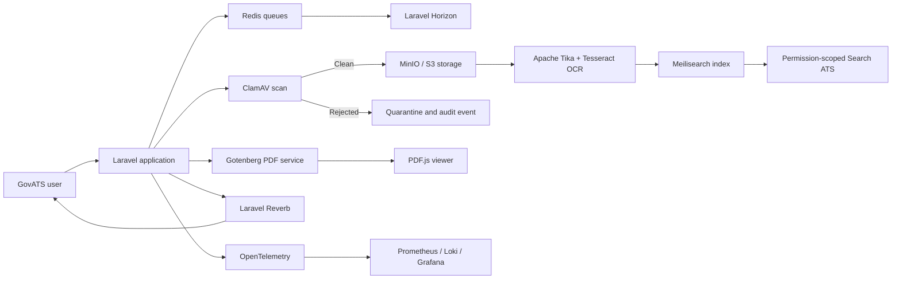

# Open-Source Integration Guide for GovATS

**Last reviewed:** 27 August 2026  
**Target system:** Laravel 13, PHP 8.2+, Inertia 2, React 19, TypeScript, Tailwind CSS 4, Redis, web push, role-scoped mail and assignment workflows

## Purpose

This guide identifies open-source projects that can add features, strengthen security, improve document handling, and raise the usability and visual quality of GovATS.

The recommendations are deliberately split into priorities. GovATS already has authentication, two-factor authentication, role permissions, audit logging, task workflows, correspondence registers, Search ATS, browser notifications, email notifications, spreadsheet export, dashboards, and attachment previews. Integrations should extend those capabilities rather than introduce a second competing workflow or permission system.

Licences and product editions can change. The licence notes below are planning aids, not legal advice. Confirm the licence of the exact version and deployment model before production adoption.

## Recommended integration architecture

The most important security rule is that external indexes, document services, dashboards, and storage must never become an alternative route around GovATS permissions. Laravel should remain the authorization boundary.

## Priority roadmap

### Phase 1 — Security, search, and document usability

1. ClamAV attachment scanning.
2. Apache Tika and Tesseract text extraction.
3. Meilisearch-backed Search ATS.
4. PDF.js document preview.
5. FullCalendar Standard for meetings and deadlines.
6. Laravel Horizon for queue visibility.

### Phase 2 — Storage, reports, and real-time operation

1. MinIO private object storage.
2. Gotenberg for consistent PDF and archival report generation.
3. Laravel Reverb for live notification and queue updates.
4. Apache ECharts for accessible performance visualizations.
5. OpenTelemetry, Prometheus, Loki, and Grafana for operational monitoring.

### Phase 3 — Collaboration and institutional integrations

1. Keycloak for government-wide SSO or directory integration.
2. Collabora Online for browser-based document editing.
3. DocuSeal for approved electronic-signature workflows.
4. Apache Superset for embedded executive analytics.
5. Uppy and Tus for large or unreliable-network uploads.

## Quick comparison

| Project | Main improvement | GovATS area | Effort | Priority |
|---|---|---|---:|---:|
| ClamAV | Malware scanning and quarantine | All attachments | Medium | Immediate |
| Apache Tika | Text and metadata extraction | Search and previews | Medium | Immediate |
| Tesseract OCR | Search scanned letters and images | Search Mail | Medium | Immediate |
| Meilisearch | Typo-tolerant, ranked full-text search | Search ATS | Medium | Immediate |
| PDF.js | Consistent in-browser PDF viewing | Mail and task drawers | Low–Medium | Immediate |
| FullCalendar Standard | Month, week, day, and list calendars | Meetings and deadlines | Low–Medium | Immediate |
| Laravel Horizon | Queue throughput and failure dashboard | Notifications and processing | Low | Immediate |
| MinIO | Private scalable attachment storage | Mail and evidence | Medium | Next |
| Gotenberg | PDF, PDF/A, merge, watermark, and conversion | Reports and correspondence | Medium | Next |
| Laravel Reverb | Live updates without refreshing | Dashboards and notifications | Medium | Next |
| Apache ECharts | Rich accessible charts | Reports and Performance | Medium | Next |
| OpenTelemetry stack | Metrics, traces, logs, and alerts | Operations | Medium–High | Next |
| Keycloak | Central SSO and identity federation | Authentication | High | Conditional |
| Collabora Online | Edit office documents in the browser | Correspondence drafting | High | Conditional |
| DocuSeal | Electronic signatures and signing audit | Executive approvals | High | Conditional |
| Apache Superset | Embedded BI and drill-down dashboards | Reports and Performance | High | Conditional |
| Uppy + Tus | Resumable, accessible uploads | Attachments and evidence | Medium | Conditional |
| TanStack Table + Virtual | Advanced, fast data tables | Mail, tasks, reports | Medium | UI improvement |
| shadcn/ui patterns | Consistent accessible components | Shared UI system | Medium | UI improvement |
| Motion for React | Refined drawer and state transitions | Shared UI system | Low–Medium | UI improvement |
| Storybook + axe-core | Component documentation and accessibility tests | Engineering quality | Medium | UI improvement |
| Mermaid / Cytoscape.js | Workflow and hierarchy diagrams | Task and mail routing | Low–Medium | UI improvement |

## 1. Search and document intelligence

### Meilisearch with Laravel Scout

**What it adds**

- Typo tolerance for names, references, senders, and subjects.
- Relevance ranking instead of database `LIKE` ordering.
- Prefix search, synonyms, highlighting, and faceted filters.
- Fast multi-index search across mail, tasks, staff, departments, and workstreams.
- Attachment-body search after Tika/OCR extraction.

**Recommended integration**

- Use Laravel Scout to synchronize searchable Eloquent models.
- Keep the existing `SearchService` as the authorization and response-format layer.
- Index only records the current search architecture already permits.
- Prefer server-side searches. If browser-to-Meilisearch access is ever introduced, use short-lived tenant tokens and filter rules.
- Store searchable attachment text separately from the original binary.
- Reindex through queued jobs after mail capture, attachment replacement, filing, reassignment, or permission-scope changes.

**Important caution**

Search results must be intersected with the viewer's current mail/task scope. An index hit is not authorization to view a record.

**Sources:** [Laravel full-text search integration](https://www.meilisearch.com/blog/laravel-full-text-search), [self-hosted security](https://www.meilisearch.com/docs/resources/self_hosting/security/overview)

### Apache Tika

**What it adds**

- Text and metadata extraction from PDF, DOCX, XLSX, PPTX, email, text, and many other formats.
- One extraction interface for more than a thousand file types.
- Content suitable for Search ATS indexing, previews, duplicate detection, and classification assistance.

**Recommended integration**

- Run Tika as an internal container or service that is inaccessible from the public internet.
- Submit files only after they pass ClamAV.
- Process extraction asynchronously through Redis queues.
- Store extraction status, parser version, detected media type, checksum, and extracted text.
- Apply size, time, memory, and page limits to untrusted documents.

Tika 4.0 introduced isolated parsing and built-in Tesseract support, but it was released very recently. Evaluate it carefully; the supported 3.3.x maintenance line may initially be more conservative for production.

**Sources:** [Apache Tika](https://tika.apache.org/), [official Docker images](https://tika.apache.org/docs/4.0.x/using-tika/docker.html)

### Tesseract OCR

**What it adds**

- Searchable text from scanned correspondence, photographed letters, and image-only PDFs.
- Optional confidence values for identifying records that need manual verification.

**Recommended integration**

- Invoke it through the full Apache Tika container or a dedicated worker.
- Keep the original scan as the legal source; OCR text is derived search data.
- Show users when a match came from OCR and allow them to open the matching page.
- Never use OCR output alone to make approval, recipient, or classification decisions.

**Source:** [Tika Docker image with Tesseract](https://tika.apache.org/docs/4.0.x/using-tika/docker.html)

## 2. Attachment security and storage

### ClamAV

**What it adds**

- Malware, macro-virus, archive, and suspicious-file scanning.
- A multi-threaded `clamd` service and automatically updated signature database.
- A defensible quarantine stage before staff can preview or download attachments.

**Recommended upload states**

1. `pending_scan`
2. `clean`
3. `quarantined`
4. `scan_failed`

Only `clean` files should become previewable or downloadable. Record the signature version, result, timestamp, file checksum, and scanning service in the audit trail. Protect the ClamAV socket; its TCP interface does not provide its own authentication.

**Licence:** GPLv2.  
**Sources:** [ClamAV overview](https://docs.clamav.net/), [scanning documentation](https://docs.clamav.net/manual/Usage/Scanning.html)

### MinIO

**What it adds**

- Private, self-hosted, S3-compatible object storage.
- Separation of large attachments from the web application filesystem.
- A path toward versioning, retention policies, replication, and independent backup.

**Why it fits this repository**

Laravel already has an S3 disk configuration. Integration primarily requires an S3-compatible Flysystem adapter, private buckets, endpoint configuration, and signed application-controlled downloads.

**Recommended safeguards**

- Keep buckets private.
- Use opaque object keys rather than original filenames.
- Encrypt storage and transport.
- Generate short-lived download links only after authorization.
- Configure lifecycle rules for temporary previews and report exports.
- Back up the database and object store as one recoverable system.

**Licence:** AGPLv3 or commercial licence. Review the deployment model before adoption.  
**Source:** [MinIO documentation](https://min.io/docs/minio/linux/index.html)

### Uppy with Tus

**What it adds**

- Drag-and-drop and accessible file selection.
- Visible upload progress, retry, pause, and resume.
- Resumable uploads for unstable connections and large files.
- Optional direct S3 uploads without routing every byte through PHP.

**Recommended integration**

- Use Uppy as the React upload interface.
- Use Tus or multipart S3 for resumability.
- Preserve Laravel validation, permission checks, attachment limits, and audit events.
- Do not mark an upload complete until ClamAV has returned a clean result.
- Avoid enabling remote URL fetching unless strict SSRF protections are in place.

**Licence:** Uppy is MIT licensed.  
**Sources:** [Uppy documentation](https://uppy.io/docs/), [Tus plugin](https://uppy.io/docs/tus/)

## 3. Document viewing, conversion, editing, and signing

### PDF.js

**What it adds**

- A consistent, branded PDF viewer inside correspondence and task drawers.
- Page navigation, zoom, text search, selectable text, and progressive loading.
- Better control than relying on browser-specific PDF plugins.

**Recommended integration**

- Build a GovATS viewer shell on PDF.js rather than embedding the unmodified generic viewer.
- Fetch PDFs through an authorized same-origin endpoint.
- Add a matching-page indicator for Search ATS attachment results.
- Preserve explicit Download and Open in new tab actions.

**Licence:** Apache-2.0.  
**Sources:** [PDF.js getting started](https://mozilla.github.io/pdf.js/getting_started/), [PDF.js API](https://mozilla.github.io/pdf.js/api/)

### Gotenberg

**What it adds**

- Reliable HTML-to-PDF and Office-to-PDF conversion through an internal HTTP API.
- PDF merge, split, metadata, watermark, encryption, PDF/A, and PDF/UA operations.
- Consistent generated reports independent of the user's browser.

**GovATS use cases**

- Parameterized report PDFs.
- Printable correspondence summaries and movement histories.
- “APPROVED”, “FILED”, or “CONFIDENTIAL” watermarks.
- Office-document preview PDFs.
- Archival PDF/A copies of final correspondence.

Run conversion in a restricted container and queue large jobs. Treat every uploaded office document as untrusted input.

**Sources:** [Gotenberg introduction](https://gotenberg.dev/docs/getting-started/introduction), [routes](https://gotenberg.dev/docs/getting-started/routes), [LibreOffice conversion](https://gotenberg.dev/docs/convert-with-libreoffice/convert-to-pdf)

### Collabora Online

**What it adds**

- Browser-based viewing and collaborative editing of DOCX, XLSX, PPTX, and OpenDocument files.
- Fewer download-edit-upload cycles when preparing correspondence.
- Integration with existing storage through WOPI.

**Recommended integration**

- Implement GovATS as a WOPI host and Collabora as the WOPI client.
- Issue short-lived access tokens tied to a user, document, and capability.
- Make editing opt-in for drafts; preserve immutable versions after dispatch or approval.
- Write every edit-session start, save, version, and finalization event to the audit trail.

Production support and edition terms require careful review. A self-built open-source deployment has different operational responsibilities from supported Collabora editions.

**Source:** [Collabora Online integration manual](https://sdk.collaboraonline.com/CO-SDK-manual.pdf)

### DocuSeal

**What it adds**

- Self-hosted electronic-signature requests.
- Fillable document templates and embedded signing experiences.
- API and webhook events for signature completion.

**Recommended use**

- Use only after the organization approves the legal and records-management model for electronic signatures.
- Connect a signing request to a correspondence or approval step.
- Store the signed artifact, certificate/evidence, signer identity, and webhook events.
- Keep GovATS as the authoritative workflow and audit record.

Some SSO, API, embedding, and enterprise features may belong to paid editions; confirm the required edition before designing around them.

**Sources:** [self-hosted DocuSeal](https://www.docuseal.com/on-premises), [developer documentation](https://www.docuseal.com/docs)

## 4. Calendars, workflow, and real-time collaboration

### FullCalendar Standard

**What it adds**

- Month, week, day, multi-month, and list views.
- Event clicking, selection, drag-and-drop, resizing, business hours, and timezone support.
- A native React integration compatible with React 19.

**GovATS use cases**

- Meetings and deadlines calendar.
- Assignment due dates and overdue markers.
- Commissioner and Permanent Secretary review schedules.
- Department workload calendar with filter chips.
- ICS import/export if calendar interoperability is later required.

Use FullCalendar Standard unless Premium scheduling features have separately approved licensing. Government entities are not included in the free non-commercial Premium licence.

**Licence:** Standard edition is MIT.  
**Sources:** [React integration](https://fullcalendar.io/docs/react), [features](https://fullcalendar.io/docs), [licence](https://fullcalendar.io/license)

### Laravel Reverb

**What it adds**

- Self-hosted WebSocket communication integrated with Laravel broadcasting.
- Live notification counts, queue updates, drawer changes, and task-status updates without polling.

**Recommended integration**

- Broadcast small event identifiers, not sensitive correspondence bodies.
- Re-authorize the user before fetching the updated resource.
- Use private and presence channels scoped by user, office, or department.
- Retain browser push for users who are offline; Reverb improves the signed-in experience.

**Source:** [Laravel Reverb documentation](https://laravel.com/docs/12.x/reverb)

### Laravel Horizon

**What it adds**

- Queue throughput, runtime, wait-time, and failure visibility.
- Worker balancing and code-driven Redis queue configuration.
- Operational insight for OCR, virus scanning, report generation, search indexing, and notifications.

Restrict the Horizon dashboard to authorized technical administrators and never expose job payloads containing sensitive text.

**Source:** [Laravel Horizon documentation](https://laravel.com/framework/docs/11.x/horizon)

### Flowable (optional advanced workflow engine)

Flowable can model BPMN approval processes, timers, escalation paths, and human tasks. It should only be considered if workflow definitions need to become configurable by process administrators. GovATS already has a tailored assignment workflow, so introducing a general BPM engine now would add significant operational and synchronization complexity.

**Source:** [Flowable documentation](https://www.flowable.com/open-source/docs/)

## 5. Reports, analytics, and data visualization

### Apache ECharts

**What it adds**

- More than twenty chart types, responsive rendering, large-data support, and data transformations.
- Accessible chart descriptions and decal patterns for color-blind users.
- Flexible SVG or Canvas rendering for dashboards and exported views.

**GovATS use cases**

- Completion and overdue trends.
- Department and division comparisons.
- Assignment aging distributions.
- Correspondence volume by direction, office, and period.
- Workflow bottleneck and turnaround-time charts.

Always provide a data table or summary alongside charts. Enable ECharts ARIA support explicitly; it is not enabled by default.

**Licence:** Apache-2.0.  
**Sources:** [Apache ECharts](https://echarts.apache.org/en/index.html), [accessibility guidance](https://echarts.apache.org/handbook/en/best-practices/aria/)

### Apache Superset

**What it adds**

- Interactive business-intelligence dashboards, drilldowns, filters, datasets, and SQL-based analytics.
- Embedded dashboards through the official SDK and short-lived guest tokens.
- Row-level security rules for embedded users.

**Recommended architecture**

- Connect Superset to read-only reporting views or a reporting replica, not mutable operational tables.
- Issue guest tokens from Laravel after checking the user's role and organizational scope.
- Add row-level rules to the token and explicitly configure allowed embedding domains.
- Use Superset for exploratory and executive analytics; keep formal operational report generation in GovATS.

**Licence:** Apache-2.0.  
**Sources:** [embedding documentation](https://superset.apache.org/user-docs/using-superset/embedding/), [network and security settings](https://superset.apache.org/docs/configuration/networking-settings/)

## 6. Identity and access management

### Keycloak

**What it adds**

- Central single sign-on and single logout.
- OpenID Connect and SAML identity federation.
- Integration with an existing government directory or identity provider.
- Central session, password, and multifactor policies.

**When to adopt it**

Adopt Keycloak when GovATS must share identity with other applications or source staff from LDAP/Active Directory. The current Fortify authentication and two-factor implementation is adequate for a standalone system, so Keycloak should not be introduced merely to replace a working login page.

GovATS should continue to own application-specific roles, office attachments, acting appointments, delegation, and record-level permissions even if Keycloak owns authentication.

**Licence:** Apache-2.0.  
**Source:** [Keycloak](https://www.keycloak.org/)

## 7. Monitoring, reliability, and audit operations

### OpenTelemetry

**What it adds**

- Standardized traces, metrics, and logs.
- Automatic Laravel request spans and manual spans for business-critical operations.
- Correlation across Laravel, Redis workers, Tika, Gotenberg, search, and storage.

**Recommended measurements**

- Request latency and error rate by route.
- Queue wait and execution time.
- Search duration and zero-result rate.
- Attachment scan and extraction duration.
- Notification delivery success and failure.
- Report generation duration.
- Database query duration without recording sensitive query parameters.

**Sources:** [OpenTelemetry PHP](https://opentelemetry.io/docs/languages/php/), [Laravel instrumentation](https://opentelemetry.io/docs/languages/php/libraries/)

### Prometheus, Grafana, and Loki

**What they add**

- Prometheus stores and queries application and infrastructure metrics.
- Loki centralizes structured logs with low-overhead label indexing.
- Grafana visualizes metrics and logs and provides operational alerting.

Keep operational Grafana separate from user-facing performance reporting. Redact correspondence subjects, annotations, names, tokens, cookies, and attachment paths from telemetry.

**Sources:** [Grafana OSS](https://grafana.com/docs/grafana/latest/introduction/), [Prometheus overview](https://grafana.com/docs/grafana/latest/fundamentals/intro-to-prometheus/), [Loki documentation](https://grafana.com/docs/loki/latest/)

## 8. UI and usability improvement projects

### shadcn/ui patterns

GovATS already uses Radix primitives and Tailwind, which makes selected shadcn/ui patterns a natural fit. Use it as an open-code reference and component source, not as a reason to rewrite the entire interface.

**Good candidates**

- Command palette.
- Accessible comboboxes and date pickers.
- Toasts and inline alerts.
- Consistent drawers, dialogs, tabs, tables, and skeleton loaders.
- Shared empty, loading, error, and permission-denied states.

Copy components into the existing design system, rename tokens to GovATS conventions, and preserve the established Uganda Government accents where required.

**Source:** [shadcn/ui introduction](https://ui.shadcn.com/docs)

### TanStack Table and TanStack Virtual

**What they add**

- Headless sorting, filtering, faceting, grouping, column visibility, resizing, and row selection.
- Virtualized rendering for very large tables.
- A consistent interaction model for mail, tasks, audit logs, staff performance, and reports.

Continue using Laravel for permission-scoped filtering, sorting, and pagination. Client-side sorting must not sort only the current server page while implying that the whole dataset was sorted. Add virtualization only after profiling shows that loaded row counts justify it.

**Sources:** [TanStack Table](https://tanstack.com/table/latest), [virtualization guidance](https://tanstack.com/table/latest/docs/framework/react/guide/virtualization)

### Motion for React

**What it adds**

- Purposeful drawer, modal, list, and layout transitions.
- Better enter/exit animations and cross-device hover/tap gestures.
- Reduced boilerplate for maintaining consistent motion.

Use it sparingly for drawer entry, collapsible sections, active-tab indicators, and optimistic status transitions. Respect `prefers-reduced-motion`; avoid continuous or decorative motion in operational screens.

Motion supports React 18.2 and later and works with Vite without special configuration.

**Source:** [Motion for React](https://motion.dev/docs/react)

### Storybook with axe-core accessibility tests

**What it adds**

- A living catalog for buttons, fields, drawers, mail rows, badges, timelines, and dashboard panels.
- Isolated visual and interaction testing.
- Automated accessibility checks that can warn or fail CI.

Start with the shared ATS components rather than page-level stories. Add light, dark, keyboard-only, long-text, empty, loading, error, and restricted-permission variants.

**Source:** [Storybook accessibility testing](https://storybook.js.org/docs/writing-tests/accessibility-testing)

### Mermaid and Cytoscape.js

These projects can improve comprehension of complex hierarchies:

- Mermaid is suitable for generated, mostly read-only workflow and architecture diagrams.
- Cytoscape.js is suitable for interactive organizational structures, delegation networks, correspondence relationships, and connected-record graphs.

Do not replace the accessible text timeline. A diagram should be an additional view with an equivalent list or table representation.

**Sources:** [Mermaid](https://mermaid.js.org/), [Cytoscape.js](https://js.cytoscape.org/)

### Workbox

Workbox can improve the existing PWA with controlled caching, offline fallbacks, background synchronization, and service-worker update handling. Sensitive mail and task responses should not be cached unless explicitly designed for encrypted offline use. Begin with static assets, navigation fallback, and safe retry queues rather than offline correspondence storage.

**Source:** [Workbox documentation](https://developer.chrome.com/docs/workbox/)

### i18next

i18next can provide structured translation keys, pluralization, namespaces, and language switching if GovATS later supports additional Ugandan languages. Add it before translating large amounts of text so strings do not remain scattered across React components.

**Source:** [i18next documentation](https://www.i18next.com/)

## 9. API and integration tooling

### OpenAPI Generator and Swagger UI

If GovATS is connected to other government systems, publish a versioned OpenAPI contract for approved endpoints. Swagger UI can provide interactive internal documentation, while OpenAPI Generator can produce typed clients.

Do not expose an API simply because documentation tooling exists. First define authentication, scopes, rate limits, idempotency, audit logging, data classification, and versioning.

**Sources:** [OpenAPI Generator](https://openapi-generator.tech/), [Swagger UI](https://swagger.io/tools/swagger-ui/)

### Node-RED (optional integration automation)

Node-RED can orchestrate approved low-code integrations such as ingesting a controlled mailbox, posting reminders to an internal service, or transferring metadata to another system. It should call a restricted GovATS API using a service account; it should never connect directly to operational database tables.

**Source:** [Node-RED documentation](https://nodered.org/docs/)

## 10. Projects to approach cautiously

### General document-management suites

Nextcloud or Paperless-ngx can add file collaboration and document management, but adopting them as a second records system risks duplicate ownership, inconsistent permissions, and fragmented audit histories. Use narrow integrations—such as Collabora editing or private object storage—unless there is an explicit institutional decision to make a separate platform authoritative.

### A second admin framework

Filament, React Admin, and similar frameworks can accelerate greenfield administration screens, but mixing them into the established Inertia/React design system can create two navigation, permission, and component models. Prefer extending the current shared components.

### Multiple UI libraries

GovATS already uses Radix, Headless UI, Lucide, and Tailwind. Do not install several additional component libraries for isolated widgets. Selectively adopt shadcn/ui source patterns and maintain one token system.

### External AI services

Cloud AI summarization or classification may expose sensitive government correspondence. Any AI feature should begin with an approved data-classification policy, private deployment or contractual controls, human confirmation, prompt-injection defenses, evaluation datasets, and explicit audit records. AI must not independently approve, file, delegate, or disclose correspondence.

## 11. Suggested first implementation package

### Deliverable A — Secure searchable attachments

- Add attachment scan status and extraction status fields.
- Quarantine every new upload.
- Scan with ClamAV.
- Store clean files in private S3-compatible storage.
- Extract text with Tika/Tesseract.
- Index permitted metadata and extracted text in Meilisearch.
- Display “Match found inside attachment” with page/context information in Search ATS.
- Re-check authorization before opening the mail or task.

### Deliverable B — Better document experience

- Add a branded PDF.js viewer.
- Generate preview PDFs through Gotenberg for supported office documents.
- Add accessible loading, failed-conversion, unsupported-file, and download states.
- Queue conversions and monitor them through Horizon.

### Deliverable C — Better daily planning

- Replace the compact meeting list with FullCalendar Standard.
- Combine meetings, reminders, task deadlines, review deadlines, and follow-ups.
- Add office/department filters and list view for mobile.
- Broadcast changes through Reverb while retaining browser push for offline users.

## 12. Adoption checklist

Before approving any integration, confirm:

- [ ] The exact version and licence have been reviewed.
- [ ] The service can be hosted in the approved jurisdiction or on premises.
- [ ] Laravel remains the authorization boundary.
- [ ] Sensitive data is not exposed in URLs, logs, metrics, search indexes, or client tokens.
- [ ] Service accounts have least-privilege scopes.
- [ ] Upload and parsing services are isolated from the public network.
- [ ] Timeouts, file limits, queue limits, and circuit breakers are defined.
- [ ] Audit events are generated for material actions and failures.
- [ ] Backup, restoration, retention, and deletion procedures include the new service.
- [ ] Light mode, dark mode, mobile layout, keyboard navigation, and screen-reader behavior are tested.
- [ ] The integration has health checks and operational dashboards.
- [ ] A safe rollback path exists.

## Final recommendation

The best near-term combination is **ClamAV + Apache Tika/Tesseract + Meilisearch + PDF.js + FullCalendar Standard + Laravel Horizon**. It substantially improves security, Search ATS, attachment usability, calendars, and operational reliability while fitting the existing architecture.

Add **MinIO, Gotenberg, Reverb, and Apache ECharts** next. Adopt **Keycloak, Collabora Online, DocuSeal, or Apache Superset** only when the corresponding institutional requirement—central identity, collaborative editing, electronic signatures, or advanced BI—is formally approved.
